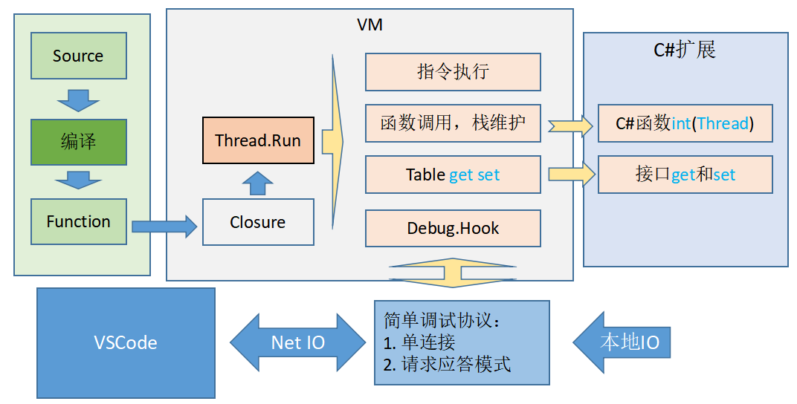

# simple script

自己写的一个简单的类Lua脚本语言SimpleScript，简称ss。【ss支持`continue`的~~，注释的起始符换成`//`而不是`--`】
包含编译器，虚拟机，调试器部分，用C#写成，可以通过C#反射扩展功能。
适合编译原理与虚拟机入门学习。

## 运行
1. vs编译运行，其中的子项目`/vs/SimpleScriptConsole`，可以单独运行。
2. 安装VSCode扩展simplescript，调试运行`vs/test.ss`。在`.vscode/launch.json`里配置了。

## 一些设计文档

## 一些源码说明
- vs工程
    - SimpleScript 语言实现的链接库
    - SimpleScriptConsole 命令行客户端
    - VSCodeDebugAdapter VSCode调试适配器，在VSCode扩展里运行使用
    - Test 测试代码，很不规范。词法和语法测试在SimpleScript的Test目录里
- 核心代码，目录在/vs/SimpleScript/core
    - Lex.cs 词法解析，正则文法
    - Parser.cs 语法解析，LL(2)文法，算符优先分析法
    - SyntaxTree.cs 语法树节点定义
    - CodeGenerate.cs 虚拟机代码生成
    - OpCode.cs 指令定义说明
    - Function.cs 函数代码，语法树编译的结果。
    - Thread.cs 执行协程，维护执行栈，执行指令
    - Value.cs 一些数据类型，实现时偷懒直接用了C#的object
    - VM.cs 虚拟机，管理资源和对外接口
- C#扩展支持
    - ImportUseReflection.cs 反射支持的实现，对于重载函数的支持糟糕啊
    - LibBase.cs 几个扩展函数的实现：`print, module, import`
- 调试支持
    - DebugProtocol.cs 调试协议，请求应答协议
    - DebugCmdAndRes.cs 具体协议命令和命令返回的定义
    - IODebug.cs 本地调试支持
    - NetDebug.cs 网络调试支持，VSCode的调试实际是tcp连接io实现的

## 编辑器支持（VSCode）
写了个VSCode扩展[simplescript](https://marketplace.visualstudio.com/items?itemName=onemore.simplescript)，支持语法高亮、snippet和调试功能(调试功能目前只能Windows用)。

插件源码目录位置：`/editor/VS Code/simplescript`
调试工程项目：`/vs/VSCodeDebugAdapter`
